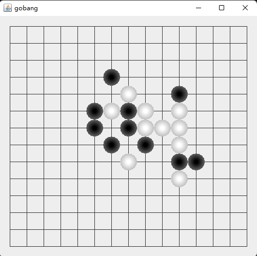
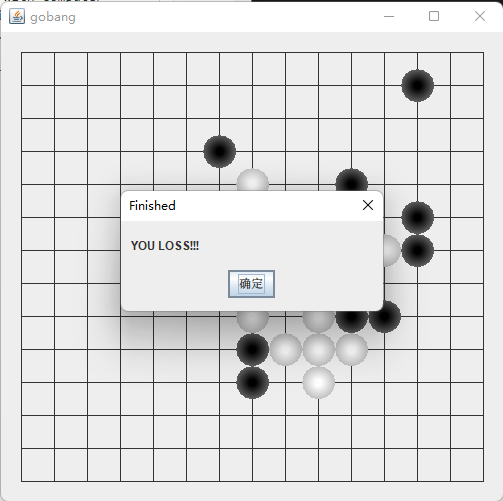

# Gobang-java
## Introduction
A basic Gobang game to compete with computer which implemented by using basic Artificial intelligence and deep learning.
## Control
Using mouse to put the chess on the board
## Example

